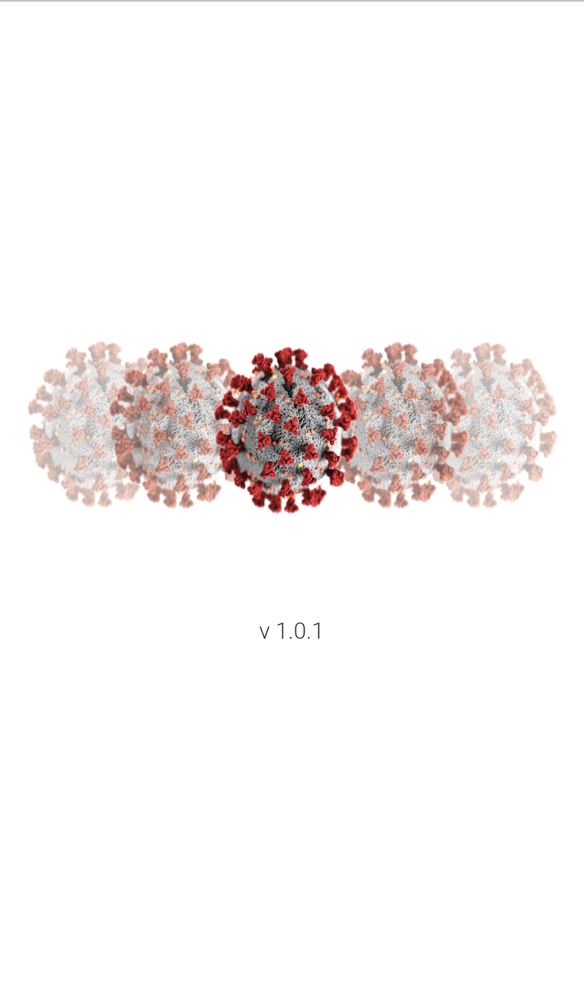
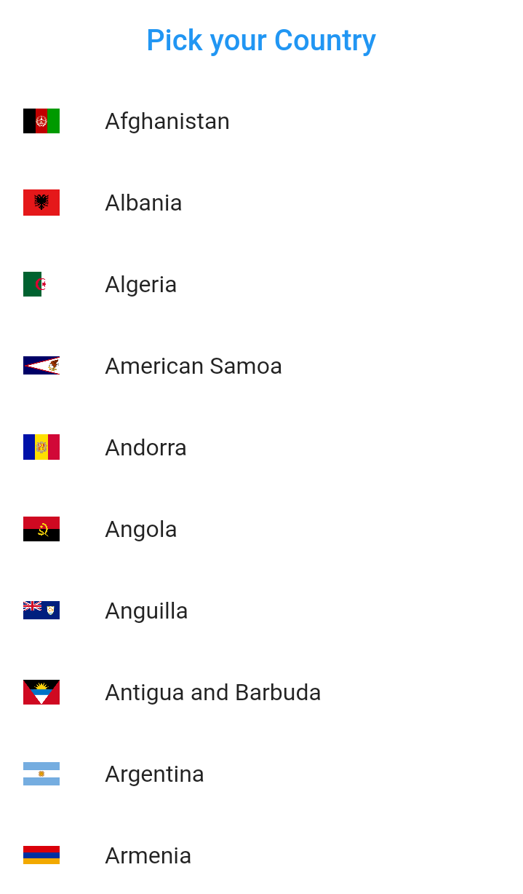
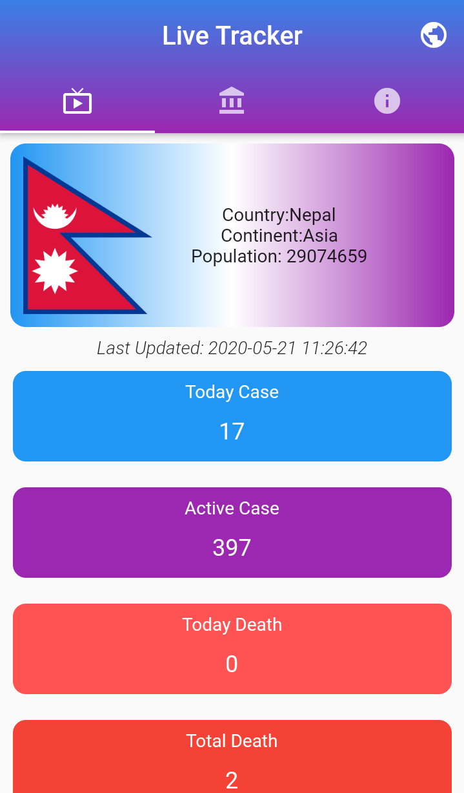
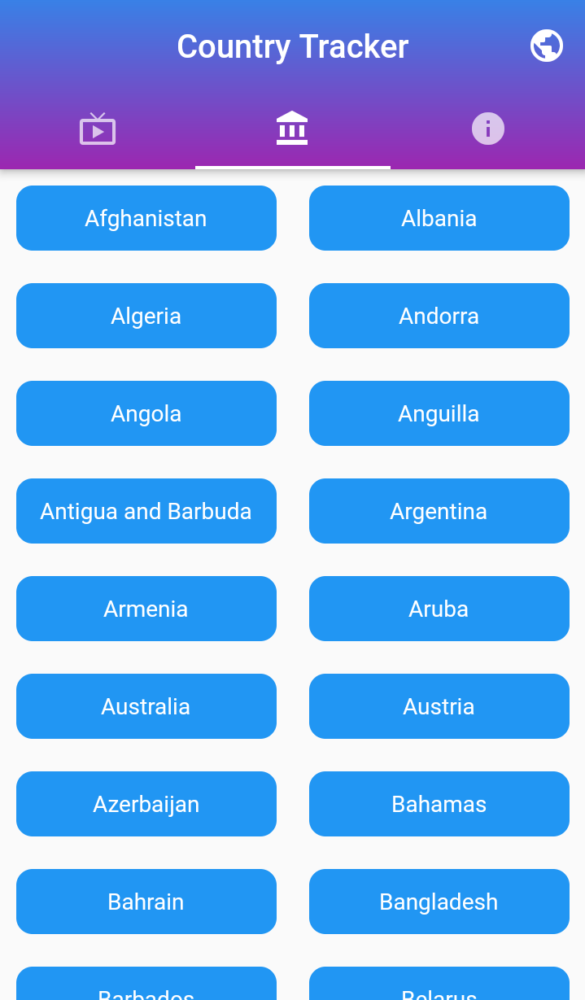
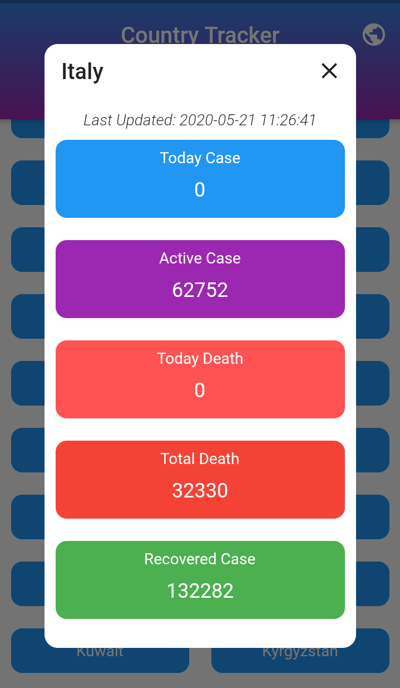

# COVID19 Tracker

A Flutter App for Showing Realtime COVID19 Information(Feel free to Use it)

## Packages Used

-Provider 
-Dio 
-Shared Preferences 
-Ola Country Picker 

## Features
 - Select your Country 
 - Showing detail of COVID 19 Data of your country
 - Show whole world data
 
 ##  API Used
  https://disease.sh/v2/countries/
  
  ## Screenshots
  

  
 
  
  
  
 

